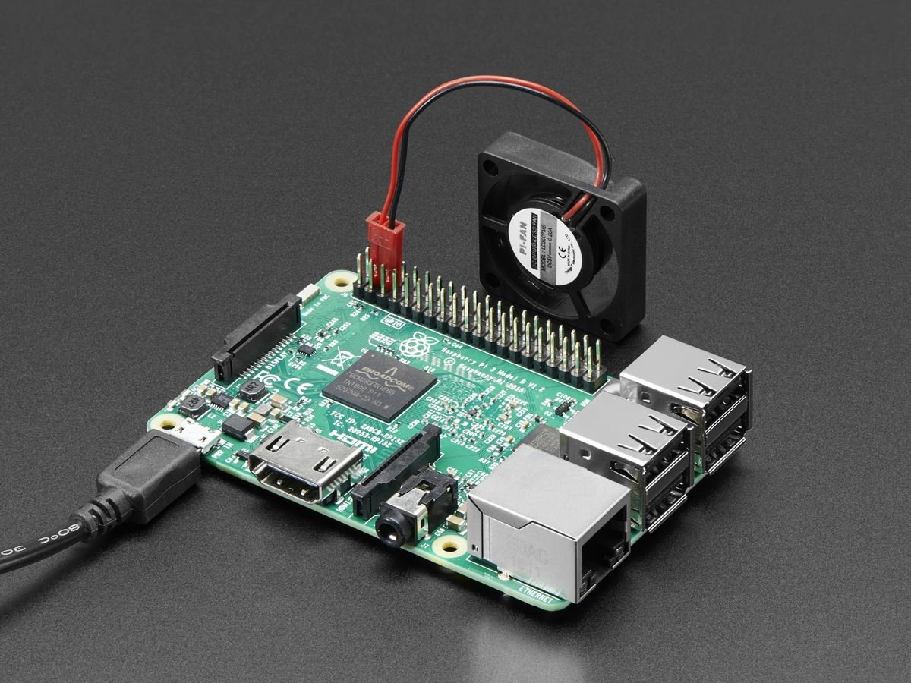
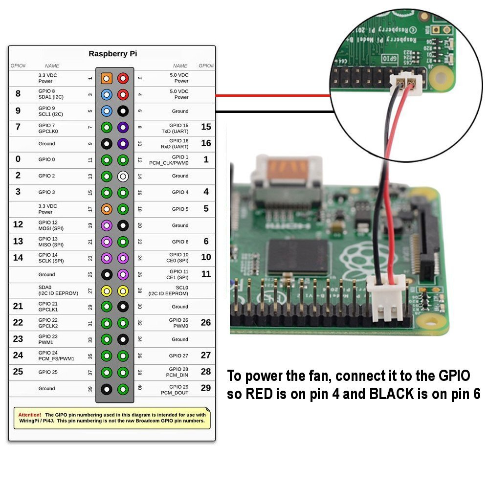
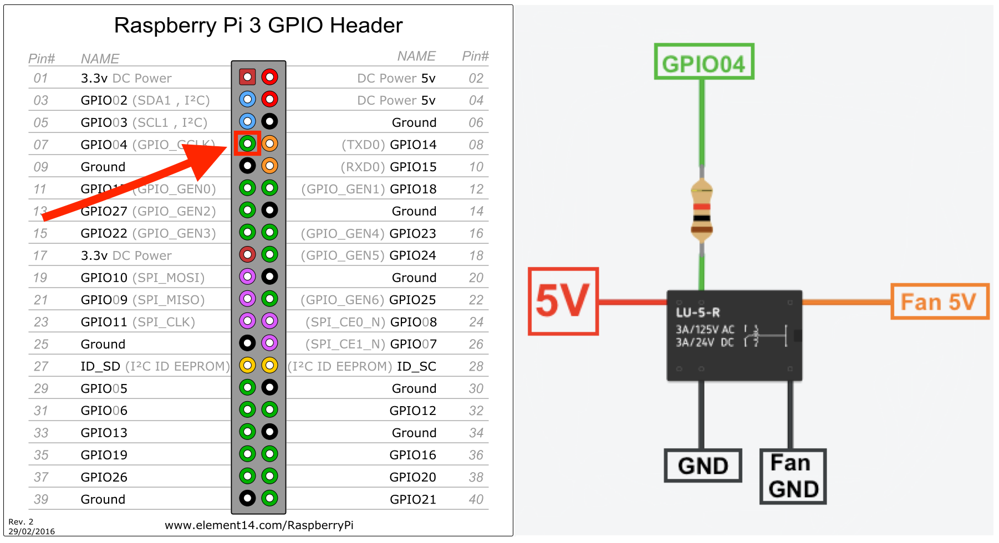

# Raspberry-Pi-3B-fan-controller
---------------------------------

   This is project enables you to control when your Raspberry Pi 3B will turn on the fan, avoiding the annoying noise even in low temperatures.

To do this you will need a fan (like below), a 5V Relay and 1kΩ.

    

    Available on: https://www.amazon.com/Adafruit-Miniature-Cooling-Raspberry-Computers/dp/B071H8RCFH/ref=sr_1_15?s=electronics&ie=UTF8&qid=1501299890&sr=1-15&keywords=small+fan+raspberry

  

    Source of image: https://www.amazon.co.uk/TRIXES-Clear-Acrylic-Cooling-Raspberry/dp/B01BKIQJD2

    To power, the fan, connect it to the GPIO so RED is on board pin 4 (5V to feed) and BLACK is on pin 6 (GND). The fan will be turned on with high speed, all time. 
    
 
 # Switch on/off the fan 
    We can't control 5v pin because it's a voltage feed. To enable us to control the fan, I add a relay on it (small enough to stay inside the raspberry's case) connected to pin 7 (GPIO4), look the scheme below: 
 

  

   When you set 1 to GPI04, the relay's coil turns on, creating an electromagnetic field that closes the gate that 5V is connected, turning on the fan.
   

# Python script

   In the src's folder, you can find the commented python code.

# Run every time you start up the Raspberry

   To run this script every time you start up the raspberry you should edit the file rc.local.
        
       /etc/rc.local
       
   By default, this file does nothing. To run your script add the following lines:
   
       (sleep 30; python /path/to/run_fan.py) &
   
   Your file will be like this:
   
       #!/bin/sh -e
       #
       # rc.local
       #
       # This script is executed at the end of each multiuser run level.
       # Make sure that the script will "exit 0" on success or any other
       # value on error.
       #
       # In order to enable or disable this script just change the execution
       # bits.
       #
       # By default this script does nothing.
       #run fan script
       
         (sleep 30; python /home/raspberrypi3b/Scripts/run_fan.py) &

         exit 0
   
   bib:
   ----
    1 - Basic concepts to GPIO:
        http://blog.fazedores.com/raspberry-pi-b-introducao-porta-gpio/
    
    2 - About raspberry temperature:
        https://raspberrypi.stackexchange.com/questions/103/whats-the-maximum-minimum-running-temperature
        
    And so many others.

   
#PS: Feel free to fork, comment, ask, criticism or suggest something to improve this project.
